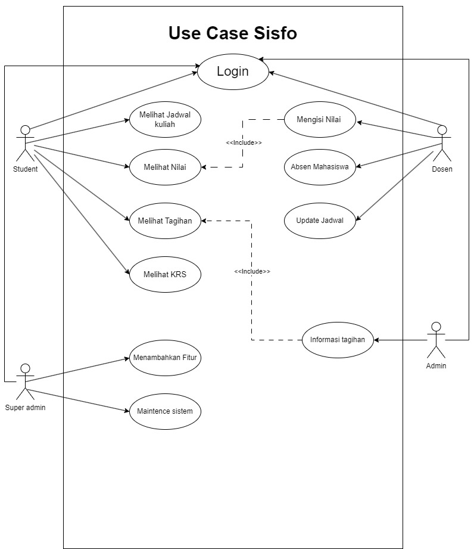

Functionality

Capability: The system should support different user roles (students, Dosen, Admin, Superadmin) with role-specific functionalities. For students, this might include viewing grades and course materials. Professors would need to post grades and course materials, admins oversee system operations, operators handle technical issues, and parents access student progress.

Reusability: Components like user authentication, data retrieval, and notification services should be designed for reuse across different modules.

Security: User authentication, data encryption, and access control are essential. Sensitive data like student records and grades must be securely managed.

Usability
Human Factors: The interface should be intuitive for all user types, accommodating varied tech proficiency. It should have a responsive design for different devices.
Consistency: The system should maintain a consistent look and feel across all modules and user roles.
Documentation: Comprehensive user guides for each user role, FAQs, and system manuals are necessary.
Reliability
Availability: The system should be available 24/7, with minimal downtime.
Failure Rate & Duration: It should have a low failure rate. Any system failures should be resolved quickly.
Predictability: System behavior in response to user actions should be predictable and consistent.
Performance
- Speed: Fast response times for user queries and actions.
- Efficiency: Optimized for minimal resource consumption without compromising functionality.
- Resource Consumption: Should be optimized to work smoothly on standard institutional hardware.
- Scalability: Capable of handling an increasing number of users and data volume.

Supportability
- Testability: The system should be easily testable to find and fix bugs.
- Extensibility: It should be designed to allow easy updates and additions of new features.
- Serviceability: Problems within the system should be easy to diagnose and fix.
- Configurability: Allow easy configuration of features like user roles, permissions, and system settings.


User Stories (Functionalities)

->Student
-Jadwal Kuliah
-Nilai
-Melihat tagihan 
-KRS

->Dosen
-Isi Nilai
-Absen
-Update Jadwal

->Super Admin
-Menambahkan fitur
-Maintence sistem

->Admin
-Menginformasikan tagihan


**Use case Diagram**




```mermaid
classDiagram
    class user {
    <<abstract>>
    +UserID
    +Password
    +login()
    +logout()
    }
    
    class Student {
    +EnrollmentID
    +Jadwal Kuliah
    +Nilai
    +absensi
    +Melihat tagihan
    +KRS
    +schedule_Kuliah()
    +lihat_absensi()
    +tagihan()
    +lihat_nilai()
    +lihat_krs()
    
    }
    
    class payment {
    +payment ID
    +Amount
    +Date
    +processPayment()
    +generateReceipt()
    +cancelPayment()
    }
    
    class Dosen {
    +FacultyID
    +Isi Nilai
    +Absen
    +materi
    +Update Jadwal
    +isi_nilai()
    +upload materi()
    +absen()
    +update_jadwal()
    }
    
    class superAdmin {
    +SuperAdminID
    +Menambahkan fitur
    +Maintence sistem
    +add_fitur()
    +maintence_system()
    }
    
    class admin {
    +AdminID
    +Menginformasikan tagihan
    +informasi_tagihan()
    }
    
    class course {
    +CourseID
    +Name
    +Description
    +StudentsEnrolled List
    +CourseMaterials
    +addStudent()
    +removeStudent()
    +updateCourseMaterial()
    
    }
    
    class grade {
    +StudentID
    +CourseID
    +LetterGrade
    +NumericScore
    +updateGrade()
    }
    
    class Attendance {
    +StudentID
    +CourseID
    +DatesAbsent
    +recordAbsence()
    +calculateAttendanceRate()


    }

    
    user <|-- Student
    user <|-- Dosen
    user <|-- superAdmin
    user <|-- admin
    
    
    Student "n" -- "1" course : enrolled in >
    course "1" -- "n" grade : has >
    course "1" -- "n" Attendance : has >
    Dosen "1" -- "n" course : Dosen >
    Student "n" -- "n" payment : make >


